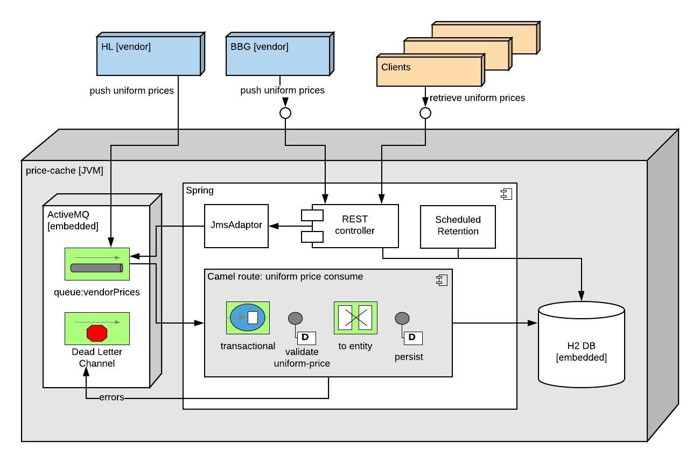
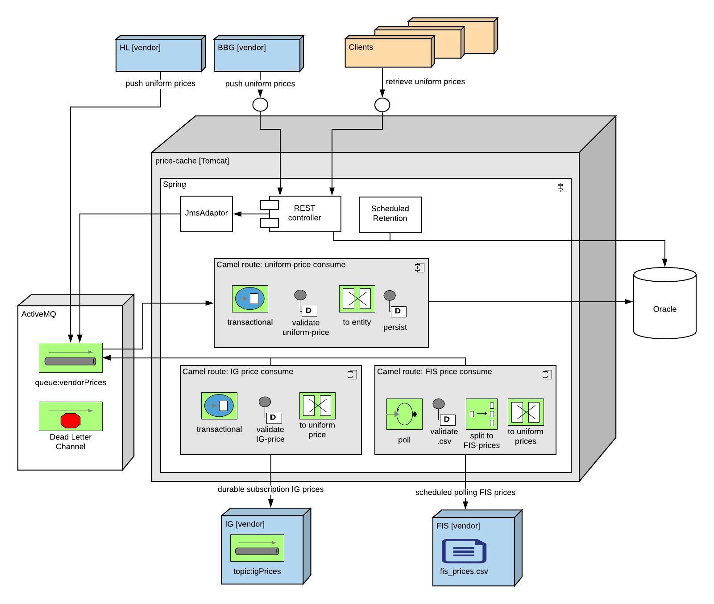

# price-cache

## Oveview
**price-cache** application features caching vendor-specific equities price data in standardised format. 
This version implements MVP requirements with design tailored for anticipated scalability.  

## Requirements

#### MVP requirements / assumptions
  * Uniform price data format is **price-cache** standard format to represent equity price from a specific vendor at a specific time. 
    It is identified by: `instrumentId`, `vendorId`, `price`, `priceTimestamp`
  * Application 
    * stores vendor-specific price into database (uniform format)
    * removes price data that is older then 30 days (based on `priceTimestamp` provided by vendors)
    * allows clients to retrieve price data (uniform format)
  * Clients:    
    * pull uniform data from **price-cache** via REST API       
        * find prices by specific vendor
        * find prices of specific instrument (equity) 
  * Vendors:
    * `HL`, pushes uniform data to **price-cache** via JMS 
    * `BBG`, pushes uniform data to **price-cache** via REST API
  * Application API does not have security restrictions 
  * Error handling
    * invalid REST requests are rejected with logged errors
    * failed JMS messages are sent to dead letter queue for further analysis/replay
  * Application has a single instance that uses:
    * in-memory JMS broker
    * in-memory database
    * 2PC transactions
      
#### Scalability requirements / assumptions [post-MVP product iteration] 
  * Add custom vendors:
    * `IG`, **price-cache** pulls non-uniform price data via JMS 
    * `FIS`, **price-cache** pulls non-uniform price data via SFTP   
  * Replace in-memory database with external Oracle
  * Replace in-memory broker with external ActiveMQ
  * Implement vendor/client security policies 
  * Containerise **price-cache** application
  * Migrate **price-cache** to cloud with traffic based auto-scaling
      
## Design

### MVP design [current]


#### Technologies
 * Java 14
 * SpringBoot 
 * Camel
 * ActiveMQ [embedded]
 * H2 DB [embedded]
 * Atomikos (JTA 2PC transactions) 
 * Swagger (REST UI)
 * Hawtio (JMX based UI for Camel, ActiveMQ broker, etc.)
 * Lombok (auto generated getters/setter/builders for POJOs)
 
#### Technical notes
 * To push uniform-price data to **price-cache**, vendors can either use REST API or JMS
 * Clients can use REST API to retrieve uniform-price data 
 * Core of the system is Camel route that pushes uniform-price data to embedded database
 * Retention policy is ensured by scheduled process which runs once every two minutes. Process removes outdated DB records which are older than 30 days
 * Camel uses Spring governed 2PC transactions backed by Atomikos global transaction manager
 * Integration tests run happy path/failure scenarios using embedded broker and embedded db
   
#### Future scalability [post-MVP design]

 * prices will be consumed from new `IG`/`FIS` vendors. 
 Adapter/translator for each vendor specific price to uniform-price will have to be implemented. 
 Uniform price processing is expected to remain unchanged.
  
## Run

#### Pre-requisites 
 * JDK 10+ (required to compile `var` type inference)
 * IntelliJ [Lombok plugin](https://plugins.jetbrains.com/plugin/6317-lombok/versions) (if running from IDE) 

#### Start application locally 

```
make up
```

#### Demo
Demo flow with screenshots can be found [here](./docs/demo/README.md) 
