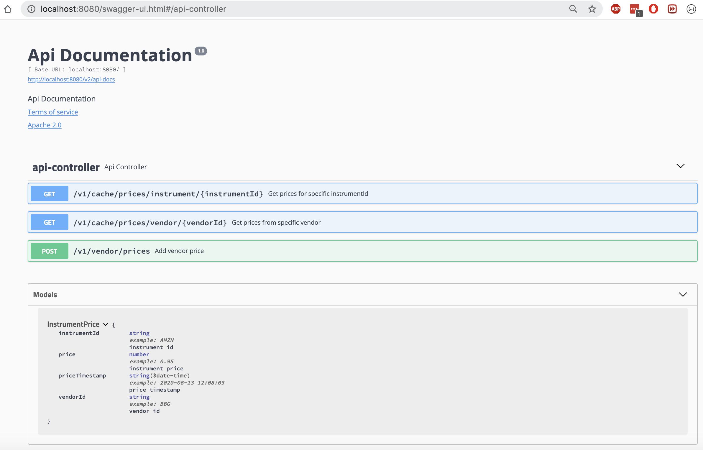
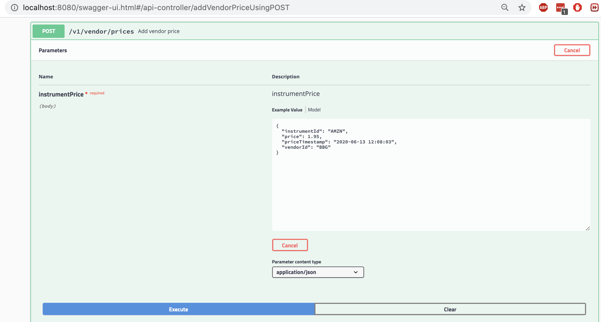
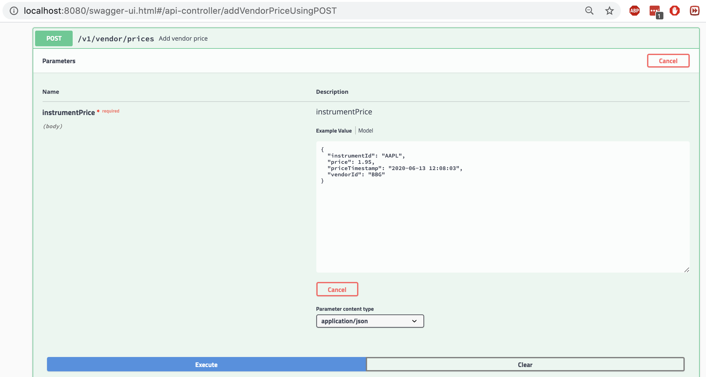
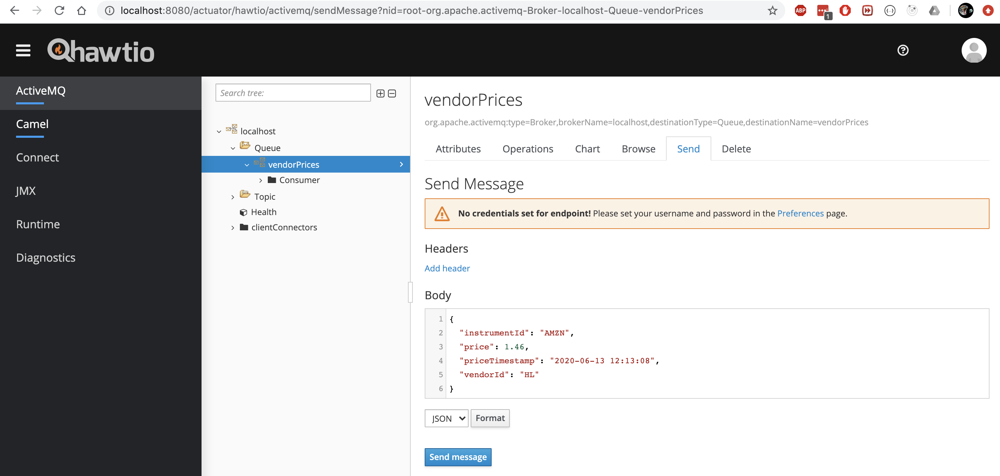
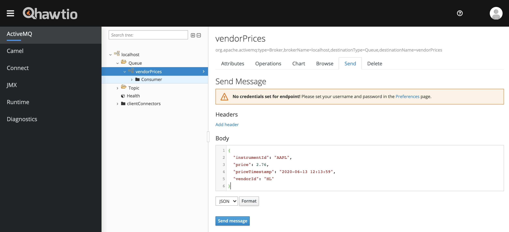
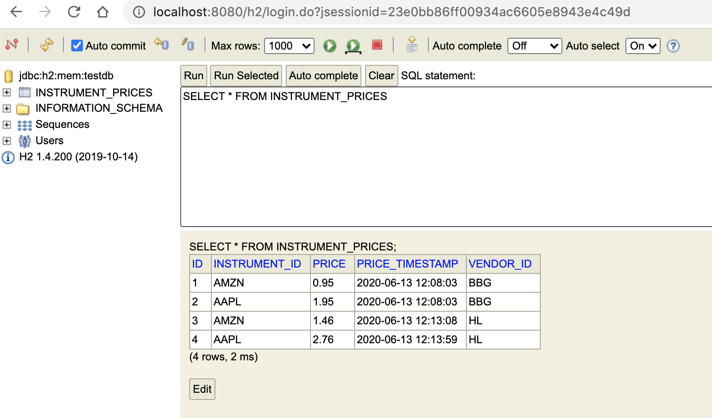
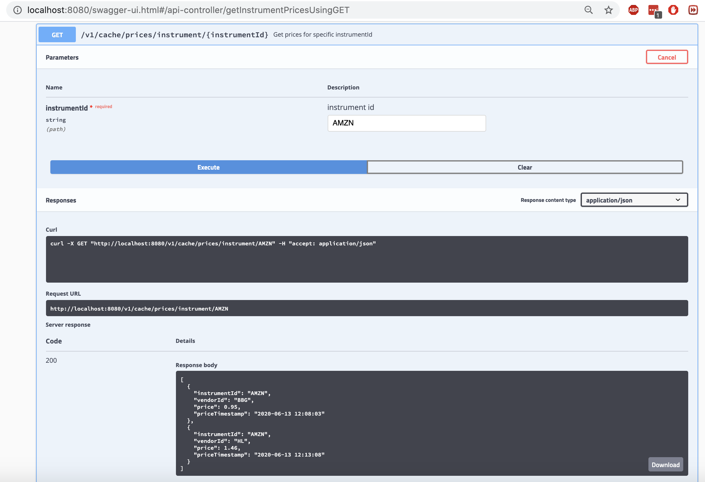

# price-cache demo

## GUI links
| Component | Endpoint | 
|--------------------------|----------------------------------------------------------------|
| Embedded ActiveMQ broker console      | http://localhost:8080/actuator/hawtio                                |
| Embedded H2 database console          | http://localhost:8080/h2        |
| Swagger UI for REST API               | http://localhost:8080        |

## Demo Summary
 * simulate vendor activity
    * add prices via REST channel
    * add prices via JMS channel
 * simulate client activity
    * get prices for vendor
    * get prices for instrument

## Example flow
### 1. Check REST API in UI

### 2. Add `BBG` vendor's price for `AMZN` using REST API

### 3. Add `BBG` vendor's price for `AAPL` using REST API

### 4. Add `HL` vendor's price for `AMZN` using JMS

### 5. Add `HL` vendor's price for `AAPL` using JMS

### 6. Check database records

### 7. Get prices for `BBG` vendor

### 8. Get prices for `AMZN` instrument
